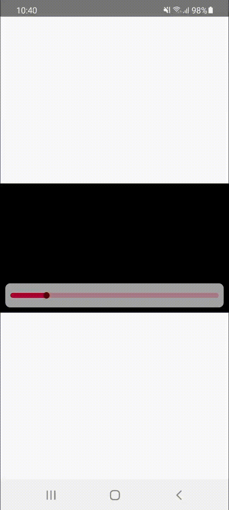

# React Native Thumbnail Preview

[](https://badge.fury.io/js/react-native-thumbnail-preview)

Thumbnail preview for video progress bar



---

## Installation

1. Run `$ npm install react-native-thumbnail-preview --save`
2. Require [react-native-image-size@1.1.3](https://github.com/eXist-FraGGer/react-native-image-size/tree/v.1.1.3) to get orifinal image size.
3. Optional [rn-fetch-blob@0.12.0](https://github.com/joltup/rn-fetch-blob/tree/v0.12.0) to caching image for improve load image only first time. (recommended)

## VTT

example vtt file: https://stdlwcdn.lwcdn.com/i/8fdb4e20-8ebb-4590-8844-dae39680d837/160p.vtt

```
WEBVTT

1
00:00:00.000 --> 00:00:01.000
160p-00001.jpg#xywh=0,0,284,160

2
00:00:01.000 --> 00:00:02.000
160p-00001.jpg#xywh=284,0,284,160
```

## Usage

- [ThumbnailPreview](#ThumbnailPreview)
- [ProgressThumbnailPreview](#ProgressThumbnailPreview)
- [ThumbnailPreviewConfig](#ThumbnailPreviewConfig)

### ThumbnailPreview

thumbnail preview like image crop from vtt and second you provided (if you need to use your prograss bar)

#### ThumbnailPreviewPops

| name          | type    | required                     | description                                                                                     |
| ------------- | ------- | ---------------------------- | ----------------------------------------------------------------------------------------------- |
| vttUrl        | string  | true                         |                                                                                                 |
| currentSecond | number  | true                         |                                                                                                 |
| baseUrl       | string  | false                        | if url image in [vtt](#VTT) file has only path like `160p-00001.jpg`, you can set baseUrl here. |
| baseMaxWidth  | number  | true, if baseMaxHeight unset | max width of thumbnail preview                                                                  |
| baseMaxHeight | number  | true, if baseMaxWidth unset  | max height of thumbnail preview                                                                 |
| children      | Element | false                        | render in ThumbnailPreview's children eg. display duration while seeking                        |

> Note. Aspect ratio calculate your `baseMaxWidth` or `baseMaxHeight` with width and height in [vtt](#VTT) file `xywh=284,0,284,160`

```javascript
import {ThumbnailPreview} from 'react-native-thumbnail-preview';

<ThumbnailPreview
  vttUrl={'https://endpoint.com/file.vtt'}
  baseUrl={'https://endpoint.com/'}
  baseMaxWidth={200}
  baseMaxHeight={200}
  currentSecond={5}>
  <Text>{00:00}</Text>
</ThumbnailPreview>;
```

### ProgressThumbnailPreview

progress bar with thumbnail preview while seeking

#### ProgressThumbnailPreviewPops

| name                         | type                                          | required | description                           |
| ---------------------------- | --------------------------------------------- | -------- | ------------------------------------- |
| style                        | ViewStyle                                     | false    | be carefull about padding, margin     |
| duration                     | number                                        | true     | video's duration (second)             |
| currentTime                  | number                                        | true     | display currentTime in progress bar   |
| thumbSize                    | number                                        | false    | default: 20                           |
| thumbTouchSize               | number                                        | false    | default: 50                           |
| trackHeight                  | number                                        | false    | default: 10                           |
| trackColor                   | string                                        | false    |                                       |
| trackRadius                  | number                                        | false    |                                       |
| trackFillColor               | string                                        | false    |                                       |
| thumbColor                   | string                                        | false    |                                       |
| thumbTouchColor              | string                                        | false    |                                       |
| onSeekStart                  | (timeSecond: number) => void                  | false    | when start seek                       |
| onSeekEnd                    | (timeSecond: number) => void                  | false    | when end seek                         |
| thumbnailPreview             | [ThumbnailPreviewPops](#ThumbnailPreviewPops) | false    | currentSecond will be replace         |
| thumbnailPreview.renderChild | (e: {seekTime: number}) => Element            | false    | render in ThumbnailPreview's children |

```javascript
import {ProgressThumbnailPreview} from 'react-native-thumbnail-preview';

<ProgressThumbnailPreview
  style={{
    backgroundColor: '#eeeeeeaf',
    justifyContent: 'center',
    borderRadius: 8,
    paddingHorizontal: 8,
    marginHorizontal: 8,
    marginBottom: 8,
  }}
  trackHeight={8}
  trackColor="#aa00333f"
  trackFillColor="#a03"
  thumbColor="#500"
  thumbTouchColor="#5500007f"
  thumbSize={10}
  thumbTouchSize={30}
  duration={52}
  currentTime={20}
  onSeekStart={() => {
    // start seek
  }}
  onSeekEnd={(time) => {
    // set video to seek time after seeking
  }}
  thumbnailPreview={{
    vttUrl: 'https://endpoint.com/file.vtt',
    baseUrl: 'https://endpoint.com/',
    baseMaxWidth: 160,
  }}
/>;
```

### ThumbnailPreviewConfig

Optionnal: Set thumbnail preview config to caching image (reccommended)

| name             | type                                       | required | description                                                                  |
| ---------------- | ------------------------------------------ | -------- | ---------------------------------------------------------------------------- |
| initCacheImage   | (RNFetchBlob) => void                      | false    | setup RNFetchBlob for caching image                                          |
| preFetchVttImage | (vttUrl: string, baseUrl?: string) => void | false    | download image and cache before display while seeking (requires RNFetchBlob) |
| removeCacheImage | () => void                                 | false    | clear cache image (requires RNFetchBlob)                                     |

> Note. if url image in [vtt](#VTT) file has only path like `160p-00001.jpg`, you can set baseUrl here.

```javascript
import {ThumbnailPreviewConfig} from 'react-native-thumbnail-preview';

useEffect(() => {
  //  setup RNFetchBlob for caching image
  ThumbnailPreviewConfig.initCacheImage(RNFetchBlob);
  // download and cache image before display thumbnail while seeking
  ThumbnailPreviewConfig.preFetchVttImage(vttUrl, baseUrl + '/');
  return () => {
    // clear cache image
    ThumbnailPreviewConfig.removeCacheImage();
  };
}, []);
```
